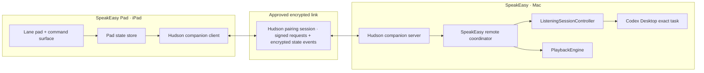

# SpeakEasy Pad architecture

**Status:** Proposed native target architecture  
**Working title:** SpeakEasy Pad  
**Platforms:** iPadOS companion + existing macOS SpeakEasy host

> **Delivery decision:** Validate the product loop first with the hosted HTTPS PWA, one-use QR bootstrap, opaque WSS rendezvous, and 24-hour Pad lease specified in [`speakeasy-pad-turnkey-mvp.md`](./speakeasy-pad-turnkey-mvp.md). The native Bonjour architecture below is the replacement path if real use justifies an App Store companion; it is not required for the first proof.

## Decision

Build the iPad app as a **thin, LAN-first trusted remote for the Mac’s existing SpeakEasy runtime**.

The Mac remains authoritative for:

- lane configuration and the active lane;
- exact Codex task locks;
- microphone capture, transcription, task submission, and narration;
- playback and queue state;
- opening Codex Desktop tasks.

The iPad renders live state and sends typed commands. It does not synthesize Mac keyboard events, read `lanes.json` directly, run a second Codex session, or become a second speech engine.

For the connection, finish the smallest native slice of Hudson’s existing pairing strategy instead of creating a SpeakEasy-specific transport:

- use Bonjour to turn nearby Macs into Hudson pairing candidates, so the normal desk-side flow does not require QR;
- use Hudson’s specified P-256 ECDH → HKDF identity and signed-request model, augmented with encrypted payload bodies;
- use explicit Mac approval and a short matching code for first trust;
- use Hudson’s endpoint classification, local-first route policy, connection state, and durable trust vocabulary;
- retain QR/deep-link payloads as manual, recovery, and future headless-host bootstrap paths.

Discovery is not authorization. A private IP or `.local` hostname can make a Mac easy to find, but it must never make that Mac automatically trusted. After the first approved exchange, pinned identities make later LAN and Tailscale reconnections silent.

Keep the SpeakEasy lane/state/command schema in a separate shared Swift module owned by SpeakEasy.

## Why this pattern

We already have three useful layers, but none should be copied wholesale.

| Existing system | Reuse | Do not import |
| --- | --- | --- |
| Scout | request IDs, reconnect/health judgment, full-snapshot-after-reconnect, and one authoritative event stream | Noise as a second Hudson pairing design, broker records, agents, sessions, tRPC catalog, hosted relay requirement |
| Talkie | P-256 ECDH/HKDF and signed-request donor code, Bonjour UX, explicit Mac approval, device registry, capability TXT records, Keychain credentials | product-specific router, terminal/session endpoints, unencrypted task metadata |
| HudsonBridge | current pairing payload/candidate/endpoint/trust-store shapes plus the proposed `HudPairingHost`/`HudPairingGuest` and remote-source strategy | treating QR as mandatory, treating LAN classification as trust, current unnecessary UI dependency |

The result avoids a fourth bespoke pairing stack while keeping SpeakEasy independent of the Scout and Talkie products.

### Donor code map

- Scout distilled client core: `/Users/arach/dev/openscout/packages/scout-ios-core/Sources/ScoutIOSCore/`
  - `BridgeConnection.swift`
  - `BonjourRelayDiscovery.swift`
  - `BonjourMacDiscovery.swift`
- Scout runtime contract: `/Users/arach/dev/openscout/docs/agent/pairing-runtime.agent.md`
- Scout LAN route judgment: `/Users/arach/dev/openscout/docs/agent/lan-direct-design.md`
- Talkie nearby host pair:
  - `/Users/arach/dev/talkie/apps/macos/TalkieAgent/TalkieAgent/Services/NearbyBridgeAdvertiser.swift`
  - `/Users/arach/dev/talkie/apps/ios/Talkie iOS/Bridge/NearbyMacBrowser.swift`
- Talkie trust and transport:
  - `/Users/arach/dev/talkie/apps/ios/Talkie iOS/Bridge/RequestSigner.swift`
  - `/Users/arach/dev/talkie/apps/ios/Talkie iOS/Bridge/BridgeClient.swift`
  - `/Users/arach/dev/talkie/apps/ios/Talkie iOS/Bridge/BridgeManager.swift`
- Hudson pairing foundation: `/Users/arach/dev/hudson/packages/native/apple/HudsonKit/Sources/HudsonBridge/HudPairing.swift`
- Hudson pairing contract: `/Users/arach/dev/hudson/docs/specs/hud-pairing-framework.md`
- Hudson remote-source strategy: `/Users/arach/dev/hudson/docs/proposals/remote-capability-sources.md`

## Product boundary

### Version 1: remote pad, Mac microphone

Pressing a lane performs the same semantic action as `⌘⌥1…9`: activate that exact task and begin listening on the Mac. The iPad is a large, legible, stateful shortcut surface.

Do **not** stream the iPad microphone in version 1. That would add audio-session ownership, compression, interruption, background, echo, and routing problems before the core pad is proven.

### Later: optional iPad microphone

If desirable, add an explicit capability such as `audio.input.stream.v1`. Treat it as a separate transport and UX mode, not as an invisible extension of the command channel.

## System shape



The remote coordinator calls the existing domain methods (`activateLane`, `toggleListening`, playback actions) directly. It never posts synthetic keystrokes, so Accessibility permission is not part of the remote path.

## Modules

### Hudson: `HudsonBridge`

`HudsonBridge` currently ships useful value types and parsers, not a live pairing runtime. Its source target contains `HudPairing.swift` and `HudDeepLink.swift`; Bonjour, CryptoKit identity, durable trust, host/guest transport, and reconnect policy remain specified but unimplemented.

Complete the smallest useful portion of the existing Hudson specs:

- remove the unnecessary `HudsonBridge → HudsonUI` target dependency;
- add `bonjour` as a pairing-candidate source;
- add generic `HudBonjourBrowser` / `HudBonjourAdvertiser` helpers using `Network.framework`;
- implement `HudPairingHost` / `HudPairingGuest` around persistent P-256 identities, ECDH/HKDF derivation, explicit approval, revocation, expiry, nonce replay protection, and request authentication;
- add AES-GCM encrypted request/response/event bodies using a separately namespaced HKDF key—the task title, response preview, and lane metadata must not travel as plain LAN HTTP;
- add a Keychain-backed `HudPairingTrustStore`, extracting the required secret-storage substrate from UI if necessary;
- add local-first route ordering, last-known-good route memory, and the shared Hudson connection-state model without treating route kind as authorization.

Keep the framework boundary described by Hudson’s remote-source proposal: Hudson owns candidates, routes, pairing mechanics, reconnect ergonomics, and diagnostics; SpeakEasy owns the protocol methods and decides what counts as healthy.

This should ship as a **source Swift package product first**. The current `hudsonkit-xcframework` release used by SpeakEasy includes `HudsonUI`, `HudsonShell`, `HudsonLive`, and `HudsonObservability`, but not `HudsonBridge`. Removing the UI dependency lets SpeakEasy consume only the source Bridge product without duplicating the binary UI modules. Add an iOS XCFramework slice later if the source integration proves awkward.

### SpeakEasy: `SpeakEasyRemoteProtocol`

A platform-neutral Swift target shared by the Mac host and iPad app:

- lane/task/voice/cue summaries;
- connection snapshot;
- listening and playback state;
- typed commands and acknowledgements;
- protocol/capability versioning;
- fixtures and Codable compatibility tests.

Do not expose local file paths as actionable iPad URLs. A lane may include a displayable project label derived on the Mac; the raw `cwd` remains optional diagnostic context.

### SpeakEasy Mac: `SpeakEasyRemoteHost`

- owns the companion server lifecycle;
- projects `ListeningSessionController` and `PlaybackEngine` into one snapshot;
- subscribes to their published values and emits coalesced state revisions;
- validates commands against the current phase and lane assignment;
- stores approved iPad identities and exposes revoke controls;
- advertises only while remote control is enabled.

### SpeakEasy Pad

- generated Xcode project via XcodeGen;
- native SwiftUI, iPadOS 18+ initially;
- owns no Codex credentials and no provider API keys;
- caches only safe display state and pairing material;
- supports keyboard shortcuts and pointer interaction in addition to touch.

## Discovery, pairing, and connection

### Discovery

- Bonjour service: `_speakeasy-pad._tcp`.
- Suggested TXT fields: `v`, `host`, `fp`, `cap`, `mode`; never advertise lane names, task IDs, transcript text, response text, or a pairing secret.
- Prefer a matching trusted Bonjour peer on the local network.
- Next try a saved Tailscale/MagicDNS endpoint from the pairing payload.
- No cloud relay in version 1. A desk-side pad should not require hosted infrastructure.

Use a stable listener port unless there is a concrete collision; `43140` is available beside Scout’s documented `43130–43132` range. Bonjour remains the source of the current LAN port.

### First pairing

The normal same-LAN flow has no QR or camera step:

1. SpeakEasy Mac enables **iPad Remote**, loads or creates its persistent P-256 identity, starts the host, and advertises `_speakeasy-pad._tcp`.
2. The iPad Local Network screen shows discovered candidates such as **Arach’s Mac · SpeakEasy · 9 lanes**.
3. The user taps the Mac. The iPad creates or loads its own persistent P-256 identity and sends a first-contact request to the discovered endpoint.
4. The devices derive the candidate shared secret and independently show the same short authentication string—a four-digit code or two memorable words derived from the complete handshake transcript.
5. The Mac asks **Allow iPad Air to control SpeakEasy?** The user confirms that the code matches and approves. The iPad confirms the matching code as well.
6. Both sides persist pinned peer identities and app-namespaced keys. Subsequent LAN and Tailscale reconnects are silent while the keys match.

If exactly one Mac is discovered, the iPad may highlight it automatically, but it must not skip first-trust approval. A matching known key may reconnect automatically; an unknown or changed key always returns to approval or fails closed.

### QR fallback

Keep the existing `HudPairingPayload` and QR/deep-link parser for:

- **Mac not visible** recovery;
- manual address or Tailscale bootstrap;
- crowded networks where the user wants an exact target;
- future headless hosts or support diagnostics.

The QR contains host identity, endpoints, public key, capabilities, and expiry. It replaces discovery and can authenticate the host key through physical scanning, but it is not required for ordinary desk-side setup.

Pairing trust and connection health remain separate. A dropped socket never silently unpairs the iPad.

### Reconnect and health

Adopt Scout’s evidence model rather than turning one timeout into “Mac offline”:

- `healthy` — active stream, successful command, or recent event;
- `suspect` — one close/timeout; reconnect silently;
- `degraded` — repeated failures; show “Trying to reach your Mac”;
- `offline` — sustained route and host failures;
- any successful authenticated message returns immediately to `healthy`.

The client uses exponential backoff with jitter, resets on foreground, and requests a fresh snapshot after every reconnection.

## Wire contract

Use compact JSON Codable envelopes as the logical contract above Hudson’s authenticated request transport. Encrypt the encoded envelope with AES-GCM before it crosses plain LAN HTTP; HMAC authentication alone protects integrity, not the privacy of task titles and response previews. Avoid tRPC and a broad REST surface for this small Swift-to-Swift domain.

```swift
struct RemoteEnvelope<Payload: Codable>: Codable {
    let version: Int
    let id: UUID
    let kind: Kind       // request, response, event
    let method: String
    let revision: UInt64?
    let sentAt: Date
    let payload: Payload
}
```

Required rules:

- every command has a UUID and is idempotent for a bounded window;
- every response echoes the request ID;
- every authenticated request uses Hudson’s device ID, timestamp, nonce, and HMAC verification with replay rejection;
- request, response, and event bodies use the app-namespaced encryption key, never the HMAC key;
- snapshots and events carry a monotonic state revision;
- reconnect always begins with a full snapshot before deltas;
- unknown methods and newer protocol versions fail explicitly;
- capabilities gate optional controls;
- command acknowledgements include accepted/rejected and the resulting revision.

### Version 1 methods

| Method | Direction | Purpose |
| --- | --- | --- |
| `system.hello` | both | protocol and capability negotiation |
| `state.snapshot` | iPad → Mac | request the complete current state |
| `state.changed` | Mac → iPad | coalesced authoritative state event |
| `lane.activateAndListen` | iPad → Mac | exact equivalent of a lane hotkey |
| `lane.activate` | iPad → Mac | select without starting the microphone |
| `lane.announce` | iPad → Mac | play the active lane cue |
| `listening.toggle` | iPad → Mac | start/finish the active listening cycle |
| `listening.cancel` | iPad → Mac | cancel warming/recording safely |
| `playback.toggle` | iPad → Mac | play/pause current narration |
| `playback.stop` | iPad → Mac | stop current narration |
| `playback.replay` | iPad → Mac | replay the last response when available |
| `task.revealOnMac` | iPad → Mac | open the exact task in Codex Desktop |

Lane editing is intentionally absent from the first command set. Start with a dependable pad; add `lane.update` only after conflict/revision behavior is designed.

## State snapshot

The iPad needs one coherent projection, not separate polling calls:

- host name, app version, connection/health state, capabilities;
- lanes 1–9 with display name, task title, project label, voice/provider summary, cue availability;
- active lane and locked task identity;
- listening phase (`ready`, `warmingUp`, `recording`, `transcribing`, `submitting`, `preparingSpeech`, `speaking`, `failed`);
- last transcript, last response preview, and recoverable error;
- playback state, progress, volume, rate, queue count;
- state revision and server time.

Mac state is authoritative. The iPad may show a brief pending press state, but it reconciles to the acknowledgement/snapshot rather than pretending a command succeeded.

## Security and privacy

- authenticated first-contact exchange and encrypted product payloads;
- stable P-256 peer identities in Keychain or mode-`0600` storage;
- matching short-authentication string plus explicit Mac approval for Bonjour-discovered first trust;
- expiring QR and one-time pairing code only for fallback bootstrap;
- explicit Mac approval and visible revoke list;
- capability allow-list—paired devices do not get arbitrary file, shell, or Scout access;
- no provider keys, full task transcripts, or audio files copied to iPad in version 1;
- redact raw task IDs and paths from logs;
- local-network permission string explains that the iPad controls SpeakEasy on the user’s Mac.

## UX implications

The architecture enables a responsive control surface:

- a 3×3 lane pad can show real assignment and active/listening state;
- a persistent command strip can change from **Hold/Tap to listen** → **Finish** → **Cancel** based on the Mac phase;
- “Open on Mac” is honest—the iPad does not claim to host the Codex task;
- connection health is distinct from pairing state;
- empty lanes remain visible but disabled or assignable later;
- hardware number keys can mirror lanes 1–9.

## Alternatives rejected

### MultipeerConnectivity as the whole stack

Easy for a demo, but opaque discovery/reconnect behavior, LAN-only reach, and limited route control make it a poor fourth architecture beside the systems already in use.

### QR as the normal LAN setup

QR is valuable when discovery fails or an exact remote endpoint must be carried physically. Requiring the camera when both apps can already see each other through Bonjour adds ceremony without improving the recurring connection. Nearby discovery plus explicit matching-code approval establishes trust with fewer steps.

### Synthetic Mac keyboard shortcuts

Would require Accessibility permission, lose acknowledgements/state, and make the iPad unable to explain failure. Call the same domain methods the hotkeys already call.

### Read or sync `lanes.json`

Configuration alone cannot represent listening, lock validation, playback, errors, or command completion. It also creates multi-writer conflict. The Mac owns the file and projects a remote-safe snapshot.

### Embed the Scout pairing runtime

It is robust but owns far more than SpeakEasy needs: relay rooms, harness sessions, tRPC, and broker-adjacent concepts. Extract its transport judgment instead.

### Copy Talkie’s complete bridge

Talkie’s cryptographic core, explicit approval, and discovery are excellent donors. Its broad product router, terminal/session endpoints, and Talkie-specific recovery semantics do not belong in SpeakEasy; lift only the generic pairing, authentication, registry, and clock-skew machinery into Hudson.

## Delivery plan

### Phase 0 — contracts and extraction

1. Make HudsonBridge UI-independent.
2. Amend the Hudson pairing spec so Bonjour discovery can produce a first-contact candidate and QR is an alternate bootstrap.
3. Implement the narrow Hudson native slice: P-256 identity, HKDF/HMAC plus encrypted bodies, durable trust, Bonjour, host/guest signed requests, local-first reconnect, and tests.
4. Add `SpeakEasyRemoteProtocol` with fixtures and compatibility tests.

### Phase 1 — vertical slice

1. Start Mac listener/advertiser behind an **Enable iPad Remote** setting.
2. Discover one Mac through Bonjour and approve it through the matching-code flow, without QR.
3. Render nine real lane assignments.
4. Implement `lane.activateAndListen`, `listening.toggle/cancel`, and live phase updates.
5. Test loss/reconnect without losing trust.

### Phase 2 — convenience surface

1. Add announce lane, playback, replay, reveal task, response preview, and volume.
2. Add keyboard/pointer/accessibility support and haptics.
3. Add Tailscale endpoint fallback and health evidence.
4. Add paired-device management and revocation.

### Phase 3 — optional editing and audio

1. Add revision-safe lane editing if the pad proves useful as an editor.
2. Evaluate iPad microphone streaming as a separate capability.
3. Evaluate a hosted relay only if remote-outside-tailnet use is a real requirement.

## First proof

The first end-to-end proof should answer one question:

> With Codex Desktop hidden behind another window, can an unconfigured iPad discover the Mac without QR, establish approved trust, show the real nine lane assignments, tap “Hudson,” start the Mac’s microphone, show every phase transition, and return to ready without synthetic keyboard input or a second Codex session?

If that works through disconnect/reconnect and survives app relaunch with trust intact, the architecture is sound.
