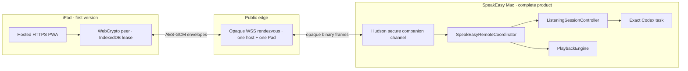

# SpeakEasy Pad — turnkey MVP architecture

**Status:** Local pilot working  
**Product order:** complete Mac app first; optional iPad web Pad second; native iPad app only after validation

## Decision

Keep SpeakEasy on the Mac as the complete product. The Mac remains authoritative for lane assignment, exact Codex task locks, microphone capture, transcription, task submission, narration, playback, and history.

The first executable pilot is served directly by the Mac at `http://pad.speakeasy.local:8255`. `8255` spells **TALK** on a telephone keypad. SpeakEasy registers the custom `.local` host through DNS-SD and includes a reachable Bonjour-hostname or numeric-address fallback in the QR flow. The installed Mac app bundles the precompiled Pad assets; Bun is a developer build tool, not a user prerequisite.

The QR URL is a revocable day-pass that lasts up to 24 hours or until SpeakEasy restarts. The exact link can be opened in Code Scanner, Safari, or another browser; every browser receives its own listed and revocable session. This gives the first version a deliberate “scan once for the app session or workday” lifecycle without accounts, permanent device administration, an App Store release, or local-certificate setup.

This local route is deliberately a trusted-LAN pilot. Because public certificate authorities cannot issue a certificate for `.local`, iPad Safari loads the page over HTTP and cannot authenticate the JavaScript origin. The short-lived capability, command allowlist, Mac-owned acknowledgements, lease expiry, and explicit revocation limit exposure, but they do not make local HTTP safe against an active LAN attacker. Do not describe this pilot as end-to-end secure.

If the interaction validates, move the same UI and protocol to a hosted HTTPS PWA with an opaque WSS rendezvous. That version adds WebCrypto, end-to-end encrypted payloads, secure service-worker installation, and internet reachability without changing the Mac coordinator or remote command schema.

If repeated use proves the Pad valuable and Safari becomes the limiting factor, replace the web client with a native SwiftUI shell using Bonjour and Keychain. The Mac coordinator and remote protocol remain unchanged.

## Secure follow-on product shape

The diagram below remains the production transport target after the local interaction pilot.



The relay is a pipe, not an authority. SpeakEasy Mac decides which Pad is approved, whether its lease is live, which commands are legal, and what state may leave the machine.

## Ownership boundaries

| Layer | Owner | Responsibility |
| --- | --- | --- |
| Mac domain runtime | SpeakEasy | lanes, exact-task locks, listening, submission, speech, playback |
| `SpeakEasyRemoteCoordinator` | SpeakEasy | remote-safe state projection, command validation, idempotency, acknowledgements |
| `SpeakEasyRemoteProtocol` | SpeakEasy | versioned JSON schema, Swift/TypeScript types, revisions, fixtures |
| Secure session | HudsonBridge | QR bootstrap mechanics, P-256/HKDF, approval, leases, revocation, reconnect |
| Browser peer | Hudson web package | WebCrypto implementation compatible with HudsonBridge |
| Rendezvous package/template | Hudson | generic one-host/one-client opaque WSS relay with limits and expiry |
| Rendezvous deployment | SpeakEasy | service availability, abuse policy, privacy policy, operational ownership |
| Scout | donor only | relay topology, request IDs, evidence-based health, reconnect and snapshot behavior |
| Talkie | donor only | P-256/HKDF/HMAC patterns, device approval, expiry, clock recovery, persistence |

Hudson’s generic remote-source layer should remain transport-neutral. Add the concrete secure pairing/session implementation as an opt-in `HudSecureCompanionChannel` under HudsonBridge. Applications supply their namespace, legal capabilities, approval policy, lease duration, and protocol handlers.

HudsonBridge currently provides useful shapes and parsers rather than a live runtime. Make the target independent of HudsonUI, implement and release the companion channel as a versioned package product, and have SpeakEasy pin the published version. Do not leave a local `../hudson` dependency.

## Turnkey desktop behavior

A normal SpeakEasy installation:

- works completely without an iPad, account, relay login, helper daemon, or Node/Bun runtime;
- starts the local listener and DNS-SD advertisement only when the Pad feature is active;
- serves only bundled static Pad assets and the allowlisted Pad protocol on port `8255`;
- continues working if the iPad, local network, or internet is unavailable;
- accepts Pad commands only while an approved 24-hour lease remains live;
- exposes **End Pad session** at all times while a lease exists.

The remote coordinator calls semantic methods such as `activateLane`, `toggleListening`, cancellation, and playback control directly. It never synthesizes hotkeys, requests Accessibility permission, exposes the Codex IPC socket, or lets the Pad read/write `lanes.json`.

## QR bootstrap

Local-pilot link shape:

```text
http://pad.speakeasy.local:8255/#v=1&room=<room>&tid=<token-id>&iat=<issued>&exp=<expires>&ct=<client-ticket>&k=<256-bit-secret>
```

All capability material is in the URL fragment. It is not included in the initial HTTP request, access logs, or referrer. The local pilot deliberately keeps the fragment visible so the exact day-pass can move from iPad Code Scanner to Safari.

Fields:

- `v` — bootstrap protocol version;
- `room` — opaque rendezvous identifier, not a secret;
- `tid` — day-pass identifier;
- `iat` / `exp` — displayable issue and expiry times;
- `ct` — compatibility ticket reserved for the hosted transport;
- `k` — independent 256-bit random bootstrap secret.

Timestamps are metadata, not key material. The Mac stores a verifier for `k` and the authoritative expiry. The browser may show “This link expired at 9:14 AM,” but it cannot extend the lifetime by editing its clock or URL.

### Local pilot redemption

1. The Mac starts its bundled Pad host on port `8255`, registers `pad.speakeasy.local`, and creates a revocable day-pass.
2. The iPad opens the fragment-bearing local URL and keeps it intact for a simple Code Scanner-to-Safari handoff.
3. Each browser presenting the day-pass receives its own revocable session, bounded by the pass expiry.
4. Commands use UUIDs, monotonic sequence numbers, bounded replay protection, an allowlist, and Mac-owned state revisions.
5. SpeakEasy lists authorized sessions with online state, LAN IP, and a best-effort MAC address. A session can be revoked individually; **End Pad session** revokes the day-pass and every session immediately.

This exchange is capability-authenticated but inherits the active-LAN limitation described above because the page itself arrived over HTTP.

### Hosted secure first connection

1. The Mac requests a room and receives a host ticket plus a one-time client ticket.
2. The Mac generates the QR secret, token ID, persistent P-256 host identity, and ten-minute expiry.
3. The iPad camera opens the HTTPS PWA. The PWA generates a nonextractable P-256 device key through WebCrypto.
4. Mac and browser exchange fresh nonces and public keys through the opaque room.
5. Both prove possession of the QR secret over a canonical transcript containing the protocol version, room, token ID, public keys, nonces, and expiry.
6. P-256 ECDH plus HKDF derives separately labelled confirmation and directional AES-GCM keys.
7. The Mac shows **Allow this iPad to control SpeakEasy?** and atomically marks the bootstrap redeemed before accepting the Pad.
8. The Mac creates one revocable 24-hour lease for the browser public key. The PWA stores the nonextractable private key, host fingerprint, lease ID, reconnect ticket, and expiry in IndexedDB.
9. The QR secret and one-time client ticket are discarded and never accepted again.

### Reconnection

Reconnections use pinned P-256 identities, fresh nonces, and newly derived directional keys. The stored QR secret is not required. Mac time and the Mac lease record are authoritative.

Clearing browser storage can reconnect through the intact day-pass URL. Expiry, Mac revocation, or a host-key change requires a new scan. The local pilot allows multiple active browser sessions; the hosted design can choose a stricter policy later.

## Rendezvous requirements

Extract a small product-neutral relay rather than depending on the full Scout runtime. Scout’s relay topology is a donor, but its agent, harness, broker, tRPC, fan-out, and host-replacement semantics do not belong in SpeakEasy.

The MVP rendezvous must provide:

- exactly one host and one Pad per room;
- independent high-entropy host, bootstrap-client, and reconnect tickets;
- ten-minute bootstrap expiry and a hard 24-hour room/lease ceiling;
- no silent host or client replacement;
- bounded frames, queues, connection count, and message rate;
- opaque binary forwarding only;
- no application parsing, payload persistence, transcript logging, task identifiers, or lane concepts;
- TLS for every public connection;
- explicit close reasons and deterministic room cleanup.

The relay inevitably observes IP addresses, connection timing, room identifiers, and ciphertext sizes. State that clearly in its privacy policy. It must not receive encryption keys or plaintext.

Do not reuse Hudson’s existing terminal/PTY relay under a misleading shared name. A clear package name such as `hudson-companion-relay` makes its boundary visible.

## Remote protocol

The wire contract is transport-neutral. Define canonical JSON schemas plus golden fixtures, then validate matching Swift Codable and TypeScript implementations.

Required properties:

- versioned request, response, and event envelopes;
- UUID command IDs with a bounded idempotency window;
- acknowledgements that echo the request ID and resulting state revision;
- monotonic Mac-owned state revisions;
- a full state snapshot after every reconnect before accepting deltas;
- explicit capability negotiation and unknown-method failures;
- independent directional keys and unique AES-GCM nonces/counters;
- no success UI until the Mac acknowledges the command.

First methods remain narrow:

- `system.hello`
- `state.snapshot`
- `state.changed`
- `lane.activateAndListen`
- `lane.activate`
- `listening.toggle`
- `listening.cancel`
- `lane.announce`
- `playback.toggle`
- `playback.stop`
- `playback.replay`
- `task.revealOnMac`

Do not add lane editing, iPad microphone streaming, arbitrary Codex messaging, files, shell, provider keys, or full transcripts to the first pilot.

## Delivery slices

### 1. Product-loop proof

- build the `SpeakEasyRemoteCoordinator` against fixtures;
- render the real nine lanes and active exact-task context in the Mac-hosted Pad;
- exercise lane activation, Mac microphone start/finish/cancel, phase updates, and playback;
- use an explicitly prototype-grade room launcher if necessary, but keep the protocol boundary final-shaped.

Success means the Pad is useful during a real work session, not merely attractive in Studio.

### 2. Secure one-day pilot

- ship the QR bootstrap, one-use redemption, explicit Mac approval, 24-hour lease, revocation, and encrypted envelopes;
- deploy the opaque rendezvous with hard TTL and abuse limits;
- test physical iPad Safari, Add to Home Screen, IndexedDB restoration, foreground reconnect, Mac relaunch, expiry, and revocation.

### 3. Hudson contribution and pinned release

- reconcile Hudson’s pairing spec with its transport-neutral remote-source proposal;
- move generic Swift/web companion mechanics and the rendezvous template into Hudson;
- add Talkie-derived cryptographic compatibility fixtures and Scout-derived reconnect/health tests;
- publish a version and update SpeakEasy’s exact pin.

### 4. Native go/no-go

Build a native iPad shell only if validated use exposes real browser limits: foreground suspension, haptics, pointer/keyboard fidelity, offline LAN operation, or repeated daily scanning.

The native client adds Bonjour discovery, direct LAN routing, Keychain identity, and native interaction. It reuses the same Mac coordinator, protocol methods, revision rules, and visual information architecture.

## Explicit non-goals

- no iPad requirement for Mac installation or first launch;
- no account system for the pilot;
- no local HTTP page carrying security-critical JavaScript;
- no HTTPS-to-local-HTTP mixed-content workaround;
- no permanent device registry before daily use is validated;
- no dependency on the Scout product runtime;
- no cloud access to provider keys, Codex databases, local file paths, or audio;
- no promise that the first web transport is the final transport.

## Go/no-go evidence

After real daily use, choose among:

- **Keep the hosted PWA** if scanning once per day, foreground operation, and relay availability are acceptable.
- **Add a native LAN client** if zero-internet operation, automatic discovery, persistent trust, haptics, or background behavior materially improve the workflow.
- **Stop** if lane selection from the iPad does not outperform the Mac hotkeys and existing menu-bar control.

The first version is intentionally cheap to discard. The Mac domain boundary and remote protocol are the durable work.
